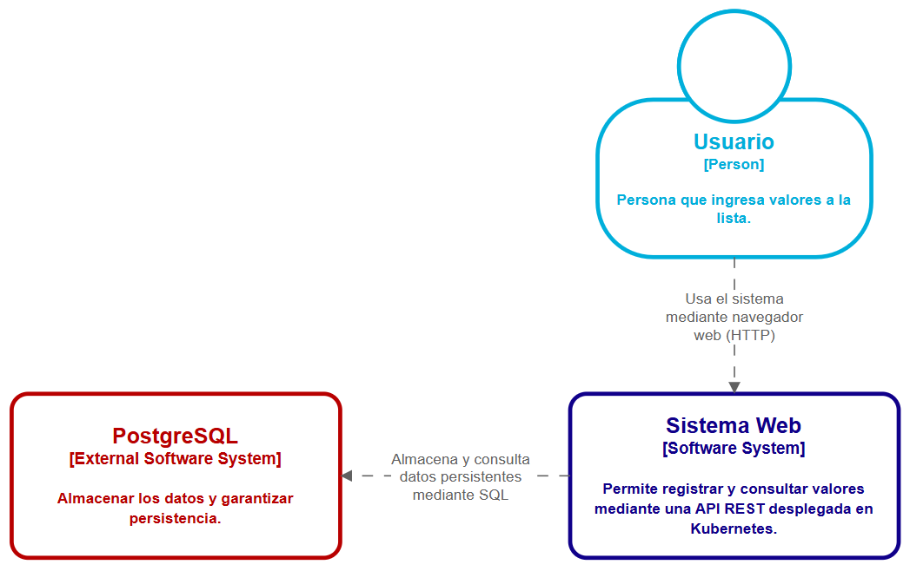
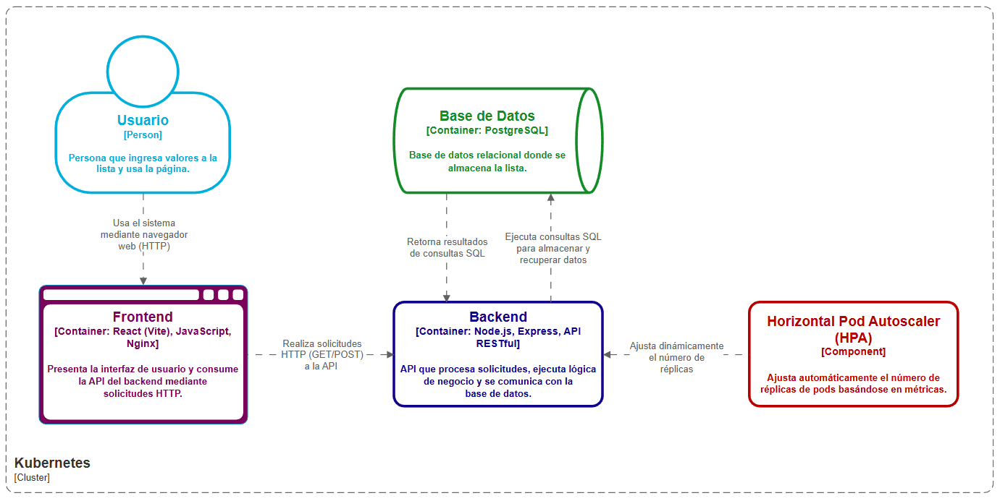

**Nombres:** Katherin Juliana Moreno Carvajal, Mariana Salas Gutiérrez

# 1. Pasos para abrir la aplicación

**1.1. Clonar y entrar al proyecto:**

git clone https://github.com/Syreus311/Patrones-II.git

cd trabajo2-k8s

**1.2. Iniciar Minikube**

minikube start

**1.3. Instalar componente metrics-server**

minikube addons enable metrics-server

**1.4. Conectar Docker al de Minikube**

minikube -p minikube docker-env --shell powershell | Invoke-Expression

**1.5. Construir backend y frontend**

docker build -t backend-image ./backend

docker build -t frontend-image ./frontend

**1.6. Aplicar Kubernetes**

kubectl apply -f k8s/

kubectl get pods

**1.7. En caso de tener problemas con el backend al iniciar**

kubectl rollout restart deployment backend

**1.8. Abrir aplicación**

minikube service frontend-service

# 2. Video de funcionamiento

[https://www.canva.com/design/DAHB7MIpz5Y/I4EAHdRcg1DDsjQhNYSr4g/watch?utm_content=DAHB7MIpz5Y&utm_campaign=designshare&utm_medium=link2&utm_source=uniquelinks&utlId=h8ffd482d22](https://www.canva.com/design/DAHB7MIpz5Y/I4EAHdRcg1DDsjQhNYSr4g/watch?utm_content=DAHB7MIpz5Y&utm_campaign=designshare&utm_medium=link2&utm_source=uniquelinks&utlId=h8ffd482d22)

# 3. Arquitectura implementada

**3.1. C1**

La aplicación utiliza una arquitectura basada en contenedores, desplegada en un clúster Kubernetes (Minikube).

El sistema está compuesto por tres componentes principales:
* **Frontend:** React, JavaScript, Nginx
* **Backend:** Node.js, Express, API RESTful
* **Base de datos:** PostgreSQL

El modelo C1 presenta el contexto general del sistema y muestra cómo interactúa con otros sistemas y actores. El sistema desarrollado corresponde a la aplicación web desplegada en Kubernetes. En general, el propósito es permitir a los usuarios registrar y consultar valores almacenados en la base de datos.

**3.2. C2**

El modelo C2 muestra la arquitectura interna del sistema, mostrando los contenedores que lo componen y cómo interactúan entre sí dentro del clúster Kubernetes. Como elementos principales se tienen:

* **Frontend:** Presenta la interfaz de usuario, consume la API REST del backend mediante solicitudes HTTP y muestra la lista de valores almacenados.
* **Backend:** Expone endpoints HTTP (GET y POST), procesa solicitudes y se comunica con la base de datos PostgreSQL.
* **Horizontal Pod Autoscaler (HPA):** Ajusta automáticamente el número de réplicas en función del uso de CPU.
* **Base de datos:** Almacena la información de forma persistente y ejecuta consultas SQL enviadas por el backend. Garantiza la persistencia mediante el uso de PersistentVolume (PV) y PersistentVolumeClaim (PVC).

# 4. Estrategia de persistencia

La estrategia de persistencia implementada tiene como objetivo garantizar que la información almacenada en la base de datos PostgreSQL no se pierda por reinicios del pod, fallos del contenedor o cambios en del clúster Kubernetes. Para lograrlo, se utiliza PersistentVolume (PV) y PersistentVolumeClaim (PVC). 

**4.1. PersistentVolume**

De acuerdo con [1], PV es una pieza de almacenamiento en el clúster que ha sido provisionada por un administrador, es decir, se define el recurso de almacenamiento físico disponible dentro del clúster Kubernetes. En este caso, se configuró un volumen de 1Gi con modo de acceso ReadWriteOnce (el volumen solo puede estar montado en modo lectura y escritura por un único nodo a la vez). También, se estableció la política *persistentVolumeReclaimPolicy: Retain*, para que los datos no sean eliminados automáticamente si el PersistentVolumeClaim es borrado.

**4.2. PersistentVolumeClaim**

Continuando con [1], PVC es una solicitud de almacenamiento por parte de un usuario que consumen recursos de PVs. En este caso, se solicita 1Gi de almacenamiento con el modo de acceso ReadWriteOnce, permitiendo que Kubernetes realice el enlace automático con un PersistentVolume compatible. Este claim es posteriormente montado en el contenedor de PostgreSQL, asegurando que los datos se almacenen en un volumen persistente. El Deployment de PostgreSQL monta el PVC en */var/lib/postgresql/data*.

# 5. Definición de recursos

**5.1. Estimación de recursos**

Teniendo en cuenta que se pueden tener 5 usuarios concurrentes promedio, con picos de hasta 30 usuarios, los recursos se definieron de la siguiente manera:

* **Request:** 
    * 477m de CPU
    * 40Mi de memoria
    
* **Limits:** 
    * 1431m de CPU
    * 120Mi de memoria

**5.2.** 

# 6. Evidencia de pruebas

# 7. Preguntas (Resumen)

**7.1. ¿Cómo configuro el HPA?**

El Horizontal Pod Autoscaler (HPA) se configuró utilizando la versión autoscaling/v2 de Kubernetes, con el objetivo de escalar automáticamente el número de réplicas del Deployment del backend en función del consumo de CPU. El archivo en el que se realizó la configuración es *hpa.yaml*.

Las características principales son:

* **minReplicas:** 2 (Garantiza que siempre existan al menos dos instancias del backend para asegurar alta disponibilidad).
* **maxReplicas:** 6 (Establece el límite máximo de escalamiento).
* **averageUtilization:** 80 (Indica que el HPA escalará cuando el uso promedio de CPU supere el 80% del valor definido en los requests del Deployment).

**7.2. ¿Cuántos recursos asigno a la API?**

En *request*, se asignaron 477m de CPU y 40Mi de memoria. Por otra parte, en *limits* se asignaron 1431m de CPU y 120Mi de memoria (el triple de los request). Esto se hizo de acuerdo a las pruebas de carga realizadas con JMeter.

**7.3. ¿Cuántos instancias necesito para 5 usuarios concurrentes?**

Se necesitan 2 instancias para 5 usuarios concurrentes.

**7.4. ¿Cuántos instancias necesito para 30 usuarios concurrentes?**

Se necesitan 3 instancias para 30 usuarios concurrentes.

# Referencias

[1] Kubernetes. (s. f.). Volúmenes persistentes. Kubernetes. Recuperado el 20 de febrero de 2026, de https://kubernetes.io/es/docs/concepts/storage/persistent-volumes/